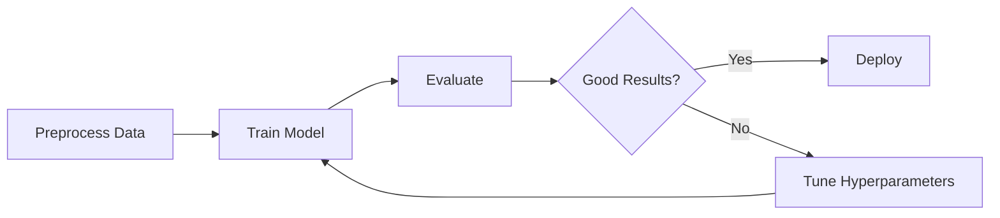

# User Guide

Comprehensive guides for using the CT Scan MLOps project.

## Overview

This section covers the main workflows for training, evaluating, and deploying CT scan classification models.

## Guides

| Guide | Description |
|-------|-------------|
| [Training](training.md) | Train models with different configurations |
| [Evaluation](evaluation.md) | Evaluate model performance |
| [Configuration](configuration.md) | Hydra configuration system |
| [Docker](docker.md) | Containerized training and deployment |

## Typical Workflow



1. **Preprocess** - Convert raw images to tensors
2. **Train** - Train with your chosen model and hyperparameters
3. **Evaluate** - Check metrics and confusion matrix
4. **Iterate** - Tune hyperparameters if needed
5. **Deploy** - Serve the model via FastAPI

## Quick Commands

```bash
# Preprocess data (run once)
invoke preprocess-data

# Train
invoke train

# Evaluate
invoke evaluate --checkpoint outputs/.../best_model.ckpt

# Serve API
invoke api
```
