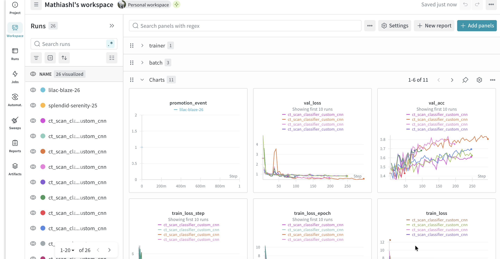
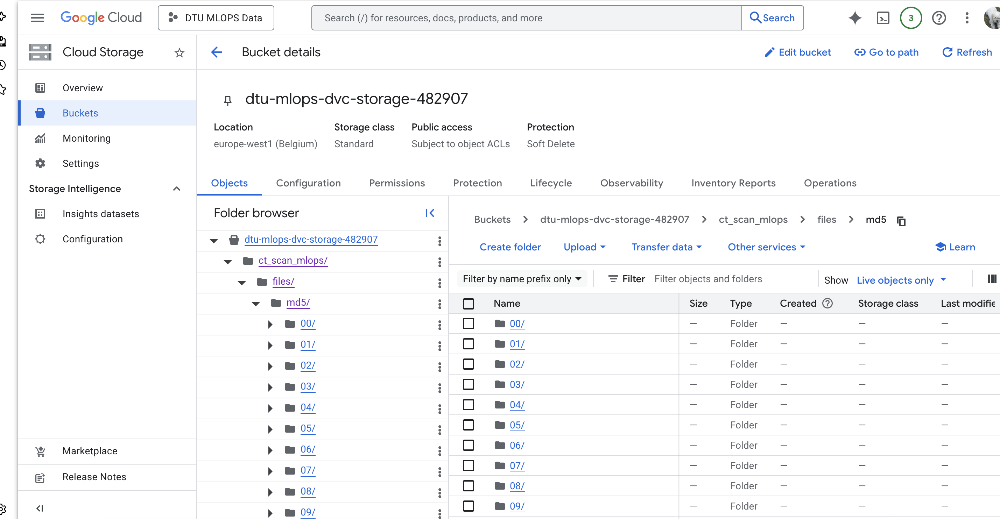
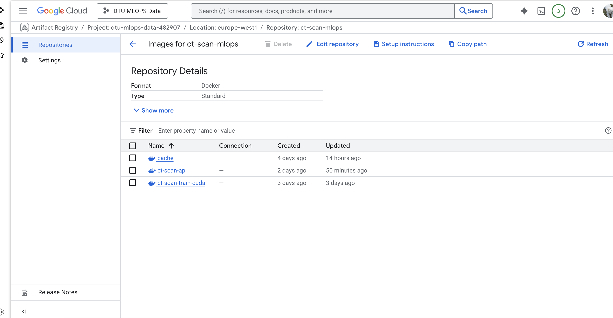
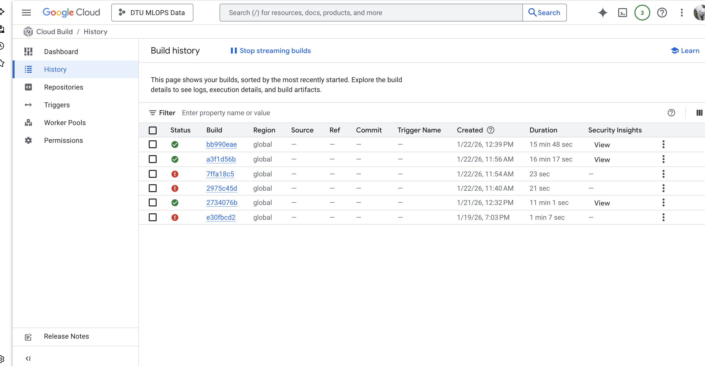
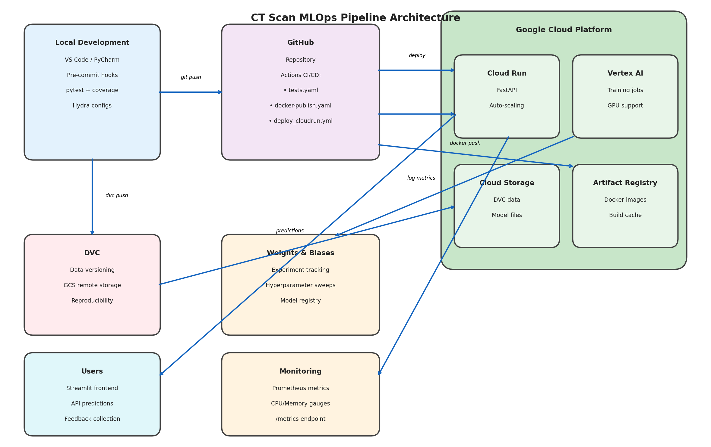

# Exam template for 02476 Machine Learning Operations

This is the report template for the exam. Please only remove the text formatted as with three dashes in front and behind
like:

```--- question 1 fill here ---```

Where you instead should add your answers. Any other changes may have unwanted consequences when your report is
auto-generated at the end of the course. For questions where you are asked to include images, start by adding the image
to the `figures` subfolder (please only use `.png`, `.jpg` or `.jpeg`) and then add the following code in your answer:

``

In addition to this markdown file, we also provide the `report.py` script that provides two utility functions:

Running:

```bash
python report.py html
```

Will generate a `.html` page of your report. After the deadline for answering this template, we will auto-scrape
everything in this `reports` folder and then use this utility to generate a `.html` page that will be your serve
as your final hand-in.

Running

```bash
python report.py check
```

Will check your answers in this template against the constraints listed for each question e.g. is your answer too
short, too long, or have you included an image when asked. For both functions to work you mustn't rename anything.
The script has two dependencies that can be installed with

```bash
pip install typer markdown
```

or

```bash
uv add typer markdown
```

## Overall project checklist

The checklist is *exhaustive* which means that it includes everything that you could do on the project included in the
curriculum in this course. Therefore, we do not expect at all that you have checked all boxes at the end of the project.
The parenthesis at the end indicates what module the bullet point is related to. Please be honest in your answers, we
will check the repositories and the code to verify your answers.

### Week 1

* [x] Create a git repository (M5)
* [x] Make sure that all team members have write access to the GitHub repository (M5)
* [x] Create a dedicated environment for you project to keep track of your packages (M2)
* [x] Create the initial file structure using cookiecutter with an appropriate template (M6)
* [x] Fill out the `data.py` file such that it downloads whatever data you need and preprocesses it (if necessary) (M6)
* [x] Add a model to `model.py` and a training procedure to `train.py` and get that running (M6)
* [x] Remember to either fill out the `requirements.txt`/`requirements_dev.txt` files or keeping your
    `pyproject.toml`/`uv.lock` up-to-date with whatever dependencies that you are using (M2+M6)
* [x] Remember to comply with good coding practices (`pep8`) while doing the project (M7)
* [x] Do a bit of code typing and remember to document essential parts of your code (M7)
* [x] Setup version control for your data or part of your data (M8)
* [x] Add command line interfaces and project commands to your code where it makes sense (M9)
* [x] Construct one or multiple docker files for your code (M10)
* [x] Build the docker files locally and make sure they work as intended (M10)
* [x] Write one or multiple configurations files for your experiments (M11)
* [x] Used Hydra to load the configurations and manage your hyperparameters (M11)
* [x] Use profiling to optimize your code (M12)
* [x] Use logging to log important events in your code (M14)
* [x] Use Weights & Biases to log training progress and other important metrics/artifacts in your code (M14)
* [x] Consider running a hyperparameter optimization sweep (M14)
* [x] Use PyTorch-lightning (if applicable) to reduce the amount of boilerplate in your code (M15)

### Week 2

* [x] Write unit tests related to the data part of your code (M16)
* [x] Write unit tests related to model construction and or model training (M16)
* [x] Calculate the code coverage (M16)
* [x] Get some continuous integration running on the GitHub repository (M17)
* [x] Add caching and multi-os/python/pytorch testing to your continuous integration (M17)
* [x] Add a linting step to your continuous integration (M17)
* [x] Add pre-commit hooks to your version control setup (M18)
* [x] Add a continues workflow that triggers when data changes (M19)
* [x] Add a continues workflow that triggers when changes to the model registry is made (M19)
* [x] Create a data storage in GCP Bucket for your data and link this with your data version control setup (M21)
* [x] Create a trigger workflow for automatically building your docker images (M21)
* [x] Get your model training in GCP using either the Engine or Vertex AI (M21)
* [x] Create a FastAPI application that can do inference using your model (M22)
* [x] Deploy your model in GCP using either Functions or Run as the backend (M23)
* [x] Write API tests for your application and setup continues integration for these (M24)
* [x] Load test your application (M24)
* [x] Create a more specialized ML-deployment API using either ONNX or BentoML, or both (M25)
* [x] Create a frontend for your API (M26)

### Week 3

* [x] Check how robust your model is towards data drifting (M27)
* [x] Setup collection of input-output data from your deployed application (M27)
* [x] Deploy to the cloud a drift detection API (M27)
* [x] Instrument your API with a couple of system metrics (M28)
* [ ] Setup cloud monitoring of your instrumented application (M28)
* [ ] Create one or more alert systems in GCP to alert you if your app is not behaving correctly (M28)
* [ ] If applicable, optimize the performance of your data loading using distributed data loading (M29)
* [ ] If applicable, optimize the performance of your training pipeline by using distributed training (M30)
* [ ] Play around with quantization, compilation and pruning for you trained models to increase inference speed (M31)

### Extra

* [ ] Write some documentation for your application (M32)
* [ ] Publish the documentation to GitHub Pages (M32)
* [ ] Revisit your initial project description. Did the project turn out as you wanted?
* [ ] Create an architectural diagram over your MLOps pipeline
* [ ] Make sure all group members have an understanding about all parts of the project
* [ ] Uploaded all your code to GitHub

## Group information

### Question 1
> **Enter the group number you signed up on <learn.inside.dtu.dk>**
>
> Answer: MLOps 2

--- question 1 fill here ---

### Question 2
> **Enter the study number for each member in the group**
>
>
> Answer: s243924, s204696, s253810, s250989

--- question 2 fill here ---

### Question 3
> **Did you end up using any open-source frameworks/packages not covered in the course during your project? If so**
> **which did you use and how did they help you complete the project?**
>
> Recommended answer length: 0-200 words.
>
> Example:
> *We used the third-party framework ... in our project. We used functionality ... and functionality ... from the*
> *package to do ... and ... in our project*.
>
> Answer: We used uv for dependency and environment management instead of the traditional pip and requirements.txt workflow. For monitoring and observability, we integrated prometheus-fastapi-instrumentator together with psutil to instrument our FastAPI application with HTTP-level metrics and system-level metrics such as CPU usage, memory usage, and process RSS. We used Streamlit to build an interactive frontend for our API, allowing users to upload CT scan images and receive predictions through a web interface.

--- question 3 fill here ---

## Coding environment

> In the following section we are interested in learning more about you local development environment. This includes
> how you managed dependencies, the structure of your code and how you managed code quality.

### Question 4

> **Explain how you managed dependencies in your project? Explain the process a new team member would have to go**
> **through to get an exact copy of your environment.**
>
> Recommended answer length: 100-200 words
>
> Example:
> *We used ... for managing our dependencies. The list of dependencies was auto-generated using ... . To get a*
> *complete copy of our development environment, one would have to run the following commands*
>
> Answer: We managed dependencies using uv together with pyproject.toml and uv.lock, following the course’s emphasis on reproducibility and environment consistency. The pyproject.toml file specifies the intended dependencies of the project, including runtime, development, and optional groups, while uv.lock pins the exact versions of all direct and transitive dependencies. This ensures that the same environment can be reproduced across different machines, operating systems, CI pipelines, and deployment targets.
>
>  To obtain an exact copy of the development environment, a new team member would first install a compatible Python version (as specified in the project) and then install uv. After cloning the repository, they simply run uv sync. This command creates a local virtual environment and installs dependencies exactly as defined in uv.lock. Because the lock file is committed to version control, every team member and automated workflow installs identical package versions. This setup minimizes “works on my machine” issues and aligns well with the course material on package management, reproducibility, and reliable software development practices.

--- question 4 fill here ---

### Question 5

> **We expect that you initialized your project using the cookiecutter template. Explain the overall structure of your**
> **code. What did you fill out? Did you deviate from the template in some way?**
>
> Recommended answer length: 100-200 words
>
> Example:
> *From the cookiecutter template we have filled out the ... , ... and ... folder. We have removed the ... folder*
> *because we did not use any ... in our project. We have added an ... folder that contains ... for running our*
> *experiments.*
>
> Answer: The project was initialized using the provided cookiecutter template, which gave us a standardized project structure. We filled out the core folders: src for source code, tests for unit tests, configs for Hydra configuration files, and reports for figures and outputs. The main application logic lives inside the ct_scan_mlops package under src. We deviated from the template by adding a dockerfiles directory containing separate Dockerfiles for training (CPU and CUDA variants) and API serving. We also added a frontend subdirectory under src for our Streamlit web application. The data folder structure was adapted to work with DVC for version control. We removed the notebooks folder as we did not use Jupyter notebooks in our workflow.

--- question 5 fill here ---

### Question 6

> **Did you implement any rules for code quality and format? What about typing and documentation? Additionally,**
> **explain with your own words why these concepts matters in larger projects.**
>
> Recommended answer length: 100-200 words.
>
> Example:
> *We used ... for linting and ... for formatting. We also used ... for typing and ... for documentation. These*
> *concepts are important in larger projects because ... . For example, typing ...*
>
> Answer: Yes, we implemented several rules and tools for code quality. For linting and formatting, we used Ruff, which enforces consistent style and catches common bugs like unused imports. We integrated Ruff into pre-commit hooks and CI for continuous enforcement. For typing, we used Python type hints with mypy for static type checking. Documentation was handled through docstrings and inline comments.
>
> These concepts matter in larger projects because they give guardrails and tools to ensure multiple developers that work on the same codebase will produce consistent formatting of code. Consistent formatting eliminates discussions about code style in code reviews. Type hints helps serve as a built in documentation, making function interfaces explicit and catching type mismatches before runtime. Static analysis tools like ruff and mypy catches bugs early, before they reach production. We found that especially ruff was very helpful in keeping our different code writing styles aligned and catching common python mistakes. It definitely saved us a lot of time.
--- question 6 fill here ---

## Version control

> In the following section we are interested in how version control was used in your project during development to
> corporate and increase the quality of your code.

### Question 7

> **How many tests did you implement and what are they testing in your code?**
>
> Recommended answer length: 50-100 words.
>
> Example:
> *In total we have implemented X tests. Primarily we are testing ... and ... as these the most critical parts of our*
> *application but also ... .*
>
> Answer: In total, we have implemented 86 tests covering critical components: data preprocessing and loading, model architecture, training logic, evaluation metrics, configuration handling, and the API layer. We included sanity checks ensuring models can learn by overfitting a single batch, verified Hydra configuration overrides, and tested training and evaluation end-to-end using synthetic data. API tests cover health checks, predictions, and error handling. All tests run without external datasets.

--- question 7 fill here ---

### Question 8

> **What is the total code coverage (in percentage) of your code? If your code had a code coverage of 100% (or close**
> **to), would you still trust it to be error free? Explain you reasoning.**
>
> Recommended answer length: 100-200 words.
>
> Example:
> *The total code coverage of code is X%, which includes all our source code. We are far from 100% coverage of our **
> *code and even if we were then...*
>
> Answer: We measure code coverage using pytest-cov as part of our testing workflow. The exact total coverage percentage depends on the latest CI run, but it can be reproduced locally by running: uv run pytest --cov=ct_scan_mlops --cov-report=term-missing giving a total of 34% code coverage.
>
> Even if our code coverage were 100% (or close to it), we would not consider the project error-free. Coverage only tells us which lines of code were executed during tests, not whether the tests meaningfully validate correctness or cover edge cases. For example, a test can execute a function without checking that its outputs are correct, and coverage would still increase. Additionally, integration issues (e.g., data formats, deployment configuration, cloud permissions) and runtime failures can occur even when all code paths are technically “covered". In general we found that most bugs were not found in unit test because the bugs were from complex integrations of multiple parts of our codebase and often also when dealing with multiple platforms such as wandb and google cloud service in the same workflow.

--- question 8 fill here ---

### Question 9

> **Did you workflow include using branches and pull requests? If yes, explain how. If not, explain how branches and**
> **pull request can help improve version control.**
>
> Recommended answer length: 100-200 words.
>
> Example:
> *We made use of both branches and PRs in our project. In our group, each member had an branch that they worked on in*
> *addition to the main branch. To merge code we ...*
>
> Answer: Our workflow used both branches and pull requests. Each team member worked on feature branches to keep the main branch stable. When a feature was ready, it was merged via a PR, which enabled review and discussion and helped catch issues early. All CI checks (unit tests, linting, Docker builds) ran before merging to reduce the risk of breaking changes. We also enabled automatic Copilot code review on PRs and its “outsider” perspective helped pointing out unintentional bugs and architecture issues. We found that having to do PRs with checks and copilot review effectively forced us to not rush code development which helped us write a more sustainable codebase.

--- question 9 fill here ---

### Question 10

> **Did you use DVC for managing data in your project? If yes, then how did it improve your project to have version**
> **control of your data. If no, explain a case where it would be beneficial to have version control of your data.**
>
> Recommended answer length: 100-200 words.
>
> Example:
> *We did make use of DVC in the following way: ... . In the end it helped us in ... for controlling ... part of our*
> *pipeline*
>
> Answer: Our dataset was static (Kaggle), so we did not use DVC for active data versioning. Instead, we used DVC mainly as storage and distribution for the preprocessed PyTorch tensor artifacts, while the underlying files lived in a Google Cloud Storage bucket. This kept the Git repository lightweight and let teammates fetch the same tensorized dataset without manual file sharing. Because the data did not change, the main benefit was reproducibility and collaboration: artifacts are tracked and tied to commits, ensuring identical inputs across local development, cloud training, and deployment.
>
> A realistic case where data version control would matter is if we start ingesting CT scans from newer equipment, which can shift intensity distributions and preprocessing outputs. Another case is when class proportions change (e.g., more cancer positives in a new cohort). In both situations, versioning the data would allow us to compare model performance across datasets, reproduce results, and roll back if needed.

--- question 10 fill here ---

### Question 11

> **Discuss you continuous integration setup. What kind of continuous integration are you running (unittesting,**
> **linting, etc.)? Do you test multiple operating systems, Python  version etc. Do you make use of caching? Feel free**
> **to insert a link to one of your GitHub actions workflow.**
>
> Recommended answer length: 200-300 words.
>
> Example:
> *We have organized our continuous integration into 3 separate files: one for doing ..., one for running ... testing*
> *and one for running ... . In particular for our ..., we used ... .An example of a triggered workflow can be seen*
> *here: <weblink>*
>
> Answer: Our continuous integration is organized into multiple GitHub Actions workflows covering different aspects of the development lifecycle. The main testing workflow (`tests.yaml`) runs pytest with coverage on a matrix of three operating systems (Ubuntu, Windows, macOS) using Python 3.12, ensuring cross-platform compatibility. We use `linting.yaml` to enforce code quality with Ruff, which performs both linting and formatting with automatic fixes committed back to the repository. The `pre-commit.yaml` workflow validates pre-commit hooks including Ruff, mypy for type checking, codespell for spelling, and detect-secrets for security scanning. For API testing, `api-tests.yaml` runs FastAPI endpoint tests separately to validate our inference service. Docker images are built using `docker-build.yaml` on pull requests and published via `docker-publish.yaml` on merge to main, building three image variants: CPU training, CUDA GPU training, and API serving. We also have `cml_data.yaml` for DVC data workflows that post sample images as PR comments, and `model_registry.yaml` for W&B model registry integration. We make extensive use of caching throughout: uv dependency caching is enabled in all workflows for faster Python package installation, and Docker layer caching uses Google Artifact Registry for persistence across builds, significantly reducing build times. While we test on multiple operating systems to ensure broad compatibility, we use a single Python version (3.12) as specified in our project requirements to maintain consistency. An example workflow can be seen here: https://github.com/DTU-MLOps-Group-2/ct_scan_mlops/actions/workflows/tests.yaml

--- question 11 fill here ---

## Running code and tracking experiments

> In the following section we are interested in learning more about the experimental setup for running your code and
> especially the reproducibility of your experiments.

### Question 12

> **How did you configure experiments? Did you make use of config files? Explain with coding examples of how you would**
> **run a experiment.**
>
> Recommended answer length: 50-100 words.
>
> Example:
> *We used a simple argparser, that worked in the following way: Python  my_script.py --lr 1e-3 --batch_size 25*
>
> Answer: We used Hydra for configuration management. All experiment settings are defined in YAML files under `configs/`, organized into subdirectories: `model/` (cnn.yaml, resnet18.yaml), `data/` (chest_ct.yaml), and `train/` (default.yaml). To run an experiment with default settings: `invoke train`. To override parameters: `invoke train --args "model=resnet18 train.max_epochs=100 train.optimizer.lr=0.001"`. This allows flexible experimentation without modifying code.

--- question 12 fill here ---

### Question 13

> **Reproducibility of experiments are important. Related to the last question, how did you secure that no information**
> **is lost when running experiments and that your experiments are reproducible?**
>
> Recommended answer length: 100-200 words.
>
> Example:
> *We made use of config files. Whenever an experiment is run the following happens: ... . To reproduce an experiment*
> *one would have to do ...*
>
> Answer: We ensured reproducibility through multiple mechanisms. First, a global seed (default: 42) is set in the configuration and applied to Python, NumPy, and PyTorch at the start of each training run. Second, Hydra automatically saves a complete snapshot of the configuration used for each experiment in the `.hydra/` output folder, allowing exact recreation of any run. Third, all hyperparameters and metrics are logged to Weights & Biases, providing a searchable history of experiments with their exact configurations. Fourth, our `uv.lock` file pins exact versions of all dependencies, ensuring the same package versions across environments. Fifth, DVC tracks data versions in Google Cloud Storage, so we can retrieve the exact dataset used for any experiment. To reproduce a run, one would check out the corresponding Git commit, run `uv sync` to restore dependencies, `dvc pull` to get the data, and execute training with the saved Hydra config.

--- question 13 fill here ---

### Question 14

> **Upload 1 to 3 screenshots that show the experiments that you have done in W&B (or another experiment tracking**
> **service of your choice). This may include loss graphs, logged images, hyperparameter sweeps etc. You can take**
> **inspiration from [this figure](figures/wandb.png). Explain what metrics you are tracking and why they are**
> **important.**
>
> Recommended answer length: 200-300 words + 1 to 3 screenshots.
>
> Example:
> *As seen in the first image when have tracked ... and ... which both inform us about ... in our experiments.*
> *As seen in the second image we are also tracking ... and ...*
>
> Answer: We used Weights & Biases (W&B) for comprehensive experiment tracking throughout the project. As shown in the first image, our W&B dashboard displays multiple training runs with their key metrics, allowing us to compare experiments across different model architectures and hyperparameter configurations. We track several important metrics during training. The training and validation loss curves show how well the model is learning and whether it is overfitting. The training and validation accuracy metrics indicate classification performance on the four-class CT scan classification task (adenocarcinoma, large cell carcinoma, squamous cell carcinoma, and normal). We also monitor the learning rate schedule to verify that our cosine annealing scheduler is working correctly. Beyond scalar metrics, W&B logs sample images from the training data at the start of each run, helping us verify that data loading and augmentation pipelines are functioning properly. The system requirements metrics (GPU memory usage, system memory) help identify resource bottlenecks. All hyperparameters from our Hydra configuration are automatically captured, making it easy to understand what settings produced each result. We also implemented W&B sweeps for hyperparameter optimization using Bayesian search, exploring learning rates, weight decay, batch sizes, and model architectures. The sweep dashboard shows parameter importance and helps identify optimal configurations. Model artifacts including checkpoints are versioned and stored in W&B, enabling model registry functionality for deployment pipelines.
>
> 

--- question 14 fill here ---

### Question 15

> **Docker is an important tool for creating containerized applications. Explain how you used docker in your**
> **experiments/project? Include how you would run your docker images and include a link to one of your docker files.**
>
> Recommended answer length: 100-200 words.
>
> Example:
> *For our project we developed several images: one for training, inference and deployment. For example to run the*
> *training docker image: `docker run trainer:latest lr=1e-3 batch_size=64`. Link to docker file: <weblink>*
>
> Answer: We developed four Docker images for different purposes. The `train.dockerfile` provides CPU-based training using a lightweight Python 3.12 base image with uv for dependency management. The `train_cuda.dockerfile` is a three-stage build using NVIDIA CUDA 12.4 base for GPU training, with build tools separated from the minimal runtime image. The `api.dockerfile` serves our FastAPI inference application, and `api.cloudrun.dockerfile` is optimized for Google Cloud Run deployment with proper port configuration. To run training locally: `docker build -f dockerfiles/train.dockerfile -t ct-scan:train . && docker run ct-scan:train`. For the API: `docker build -f dockerfiles/api.dockerfile -t ct-scan:api . && docker run -p 8000:8000 -e MODEL_PATH=/models/best.pt ct-scan:api`. Models are mounted at runtime rather than baked into images. Link to API Dockerfile: https://github.com/DTU-MLOps-Group-2/ct_scan_mlops/blob/master/dockerfiles/api.dockerfile

--- question 15 fill here ---

### Question 16

> **When running into bugs while trying to run your experiments, how did you perform debugging? Additionally, did you**
> **try to profile your code or do you think it is already perfect?**
>
> Recommended answer length: 100-200 words.
>
> Example:
> *Debugging method was dependent on group member. Some just used ... and others used ... . We did a single profiling*
> *run of our main code at some point that showed ...*
>
> Answer: Debugging is individual from teammate to teammate, with some using loguru logging, terminal debugging or coding agents (e.g. copilot) for debugging support. We extensively use loguru throughout the codebase for structured logging with automatic file rotation and compression for size management and readability. For profiling, we integrated PyTorch Profiler directly into our training script. When enabled in the configuration (`train.profiling.enabled: true`), the profiler runs on the first batch of the first epoch, capturing CPU time per operation, tensor shapes, and call stacks. The output includes a summary table showing the most time-consuming operations and TensorBoard trace files in `artifacts/profiling/`. Profiling revealed that batch normalization consumed 63% of CPU time, followed by dropout at 15%, while convolutions were relatively efficient at 5%. This confirmed our model architecture was compute-bound rather than I/O-bound.

--- question 16 fill here ---

## Working in the cloud

> In the following section we would like to know more about your experience when developing in the cloud.

### Question 17

> **List all the GCP services that you made use of in your project and shortly explain what each service does?**
>
> Recommended answer length: 50-200 words.
>
> Example:
> *We used the following two services: Engine and Bucket. Engine is used for... and Bucket is used for...*
>
> Answer: We used four main GCP services. Google Cloud Storage (GCS) stores our training data and model artifacts, integrated via DVC for version control. Google Artifact Registry (GAR) hosts our Docker container images with layer caching for faster CI/CD builds. Google Cloud Run deploys our FastAPI inference API as a serverless container with automatic scaling and GCS bucket mounting for model files. Google Vertex AI runs training jobs using custom containers, supporting both CPU and GPU (NVIDIA Tesla T4) configurations triggered via GitHub Actions workflows.

--- question 17 fill here ---

### Question 18

> **The backbone of GCP is the Compute engine. Explained how you made use of this service and what type of VMs**
> **you used?**
>
> Recommended answer length: 100-200 words.
>
> Example:
> *We used the compute engine to run our ... . We used instances with the following hardware: ... and we started the*
> *using a custom container: ...*
>
> Answer: We used Vertex AI for model training, which provisions Compute Engine VMs under the hood. Our `train_vertex.yml` GitHub Actions workflow creates custom training jobs with configurable parameters: model architecture (CNN or ResNet18), number of epochs, W&B logging mode, and accelerator type. For CPU training, Vertex AI provisions n1-standard-8 instances (8 vCPU, 30GB RAM). For GPU training, we add an NVIDIA Tesla T4 accelerator to the VM. The workflow builds a Docker image from our `train_cuda.dockerfile`, pushes it to Artifact Registry, then creates a Vertex AI custom job using the gcloud CLI. The container includes DVC support and automatically pulls training data from GCS before starting. W&B API keys are injected via GCP Secret Manager for secure experiment tracking.

--- question 18 fill here ---

### Question 19

> **Insert 1-2 images of your GCP bucket, such that we can see what data you have stored in it.**
> **You can take inspiration from [this figure](figures/bucket.png).**
>
> Answer:
>
> 
> 

--- question 19 fill here ---

### Question 20

> **Upload 1-2 images of your GCP artifact registry, such that we can see the different docker images that you have**
> **stored. You can take inspiration from [this figure](figures/registry.png).**
>
> Answer:
>
> 

--- question 20 fill here ---

### Question 21

> **Upload 1-2 images of your GCP cloud build history, so we can see the history of the images that have been build in**
> **your project. You can take inspiration from [this figure](figures/build.png).**
>
> Answer:
>
> 

--- question 21 fill here ---

### Question 22

> **Did you manage to train your model in the cloud using either the Engine or Vertex AI? If yes, explain how you did**
> **it. If not, describe why.**
>
> Recommended answer length: 100-200 words.
>
> Example:
> *We managed to train our model in the cloud using the Engine. We did this by ... . The reason we choose the Engine*
> *was because ...*
>
> Answer: We managed to get cloud training working on Google Vertex AI. We implemented a GitHub Actions workflow (`train_vertex.yml`) that builds the training Docker image (CPU or CUDA), pushes it to Artifact Registry, and creates a Vertex AI custom job with the desired machine type (n1-standard-8) and optional NVIDIA Tesla T4 GPU. The container pulls training data via DVC from GCS and logs metrics to W&B using credentials from Secret Manager. However, because the setup took significant time, we did not run the main part of our experiments on Vertex AI and instead used it mainly to validate that the cloud pipeline worked end-to-end. We chose Vertex AI over raw Compute Engine for its managed infrastructure, automatic cleanup, and tighter integration with GCP ML services.

--- question 22 fill here ---

## Deployment

### Question 23

> **Did you manage to write an API for your model? If yes, explain how you did it and if you did anything special. If**
> **not, explain how you would do it.**
>
> Recommended answer length: 100-200 words.
>
> Example:
> *We did manage to write an API for our model. We used FastAPI to do this. We did this by ... . We also added ...*
> *to the API to make it more ...*
>
> Answer: YWe wrote a FastAPI application for model inference. The API exposes four endpoints: `/health `returns API status and model availability, `/predict` accepts CT scan image uploads and returns the predicted class (one of four: adenocarcinoma, large cell carcinoma, squamous cell carcinoma, or normal) with confidence scores, `/feedback` collects user corrections for model improvement, and `/metrics` exposes Prometheus metrics. The model is loaded asynchronously on startup using a lifespan context manager, supporting both PyTorch and Lightning checkpoint formats. Images are preprocessed using torchvision transforms (resize to 224x224, normalize with ImageNet statistics). We added Prometheus instrumentation via prometheus-fastapi-instrumentator for automatic HTTP metrics collection and custom gauges for system metrics.

--- question 23 fill here ---

### Question 24

> **Did you manage to deploy your API, either in locally or cloud? If not, describe why. If yes, describe how and**
> **preferably how you invoke your deployed service?**
>
> Recommended answer length: 100-200 words.
>
> Example:
> *For deployment we wrapped our model into application using ... . We first tried locally serving the model, which*
> *worked. Afterwards we deployed it in the cloud, using ... . To invoke the service an user would call*
> *`curl -X POST -F "file=@file.json"<weburl>`*
>
> Answer: We deployed our API both locally and in the cloud. Locally, we run the FastAPI server using `invoke api` which starts uvicorn with auto-reload for development. For cloud deployment, we use Google Cloud Run via the `deploy_cloudrun.yml` GitHub Actions workflow. The workflow builds our `api.cloudrun.dockerfile` image, pushes it to Artifact Registry, and deploys to Cloud Run with 4GB memory and 2 CPUs. The model files are mounted from a GCS bucket rather than baked into the image, allowing model updates without redeployment. To invoke the deployed service: `curl -X POST -F "file=@ct_scan.png" https://ct-scan-api-HASH-ew.a.run.app/predict`. The API also supports unauthenticated access for demonstration purposes and includes a TCP startup probe for health checking.

--- question 24 fill here ---

### Question 25

> **Did you perform any unit testing and load testing of your API? If yes, explain how you did it and what results for**
> **the load testing did you get. If not, explain how you would do it.**
>
> Recommended answer length: 100-200 words.
>
> Example:
> *For unit testing we used ... and for load testing we used ... . The results of the load testing showed that ...*
> *before the service crashed.*
>
> Answer: Yes. For unit testing we use pytest with FastAPI’s TestClient in [tests/test_api.py](tests/test_api.py). Tests cover `/health`, `/predict` with valid/invalid images, `/feedback`, and error handling when the model is not loaded; mock models isolate tests from real checkpoints. For load testing we use Locust in [tests/locustfile.py](tests/locustfile.py). The `ApiUser` simulates real usage by uploading a sample PNG to `/predict` (weight 2) and checking `/health` (weight 5) with 0.5–2 s think time. The `StressTestShape` is more aggressive, ramping 100→250→400→600→800 users before cool-down. The latest stress run produced 19,616 total requests (14,007 `/health`, 5,609 `/predict`) at ~190.28 RPS with 0 failures. Aggregate latency was 945 ms average, 470 ms median, p95 ≈ 3,000 ms, p99 ≈ 3,500 ms, with max 6,268 ms. It was a bit surprising that we saw zero failures, because the ramp was very aggressive and the service was under heavy load. But it still makes sense since the API kept responding by queuing work and stretching tail latency instead of dropping requests.

--- question 25 fill here ---

### Question 26

> **Did you manage to implement monitoring of your deployed model? If yes, explain how it works. If not, explain how**
> **monitoring would help the longevity of your application.**
>
> Recommended answer length: 100-200 words.
>
> Example:
> *We did not manage to implement monitoring. We would like to have monitoring implemented such that over time we could*
> *measure ... and ... that would inform us about this ... behaviour of our application.*
>
> Answer: Yes, we implemented monitoring using Prometheus metrics. Our FastAPI application uses prometheus-fastapi-instrumentator to automatically collect HTTP-level metrics (request counts, latencies, response sizes) exposed at the `/metrics` endpoint. Additionally, we implemented a custom Prometheus Counter to count how many our model makes wrong prediction using feedback from users in the frontend. While we instrumented the API with metrics, we did not fully set up GCP Cloud Monitoring dashboards or alerting rules instead we created SOLs for latency and availability , and we created an alert for latency if it is more than one second . The metrics endpoint is ready for scraping by Prometheus, which could then feed into Grafana for visualization or alerting.

--- question 26 fill here ---

## Overall discussion of project

> In the following section we would like you to think about the general structure of your project.

### Question 27

> **How many credits did you end up using during the project and what service was most expensive? In general what do**
> **you think about working in the cloud?**
>
> Recommended answer length: 100-200 words.
>
> Example:
> *Group member 1 used ..., Group member 2 used ..., in total ... credits was spend during development. The service*
> *costing the most was ... due to ... . Working in the cloud was ...*
>
> Answer: Our group used a total of $26.78 in GCP credits during the project. The most expensive service was Artifact Registry, which accounted for $26.73 of the total spend. This cost was driven almost entirely by Network Internet Egress charges, resulting from frequent rebuilds and reuploads of our docker builds. Other services like Cloud Run ($0.04) and Cloud Storage ($0.02) incurred negligible costs.
>
> In general, working in the cloud was by far the biggest time consumer of all our project tasks. It was very challenging to navigate GCP, understand all its subparts, and manage the necessary permissions. Once configured, we did see the value in the automatic scaling and managed infrastructure, but all of us agreed that the UI was very confusing for GCP and that it was difficult to learn.

--- question 27 fill here ---

### Question 28

> **Did you implement anything extra in your project that is not covered by other questions? Maybe you implemented**
> **a frontend for your API, use extra version control features, a drift detection service, a kubernetes cluster etc.**
> **If yes, explain what you did and why.**
>
> Recommended answer length: 0-200 words.
>
> Example:
> *We implemented a frontend for our API. We did this because we wanted to show the user ... . The frontend was*
> *implemented using ...*
>
> Answer: We implemented a deployable hosted frontend via Streamlit that connects to GCP with a user-friendly interface for uploading CT scan images. We also implemented the bandit security workflow and PI label workflow as automatic checks for pull requests in order to keep the codebase safe and well structured.

--- question 28 fill here ---

### Question 29

> **Include a figure that describes the overall architecture of your system and what services that you make use of.**
> **You can take inspiration from [this figure](figures/overview.png). Additionally, in your own words, explain the**
> **overall steps in figure.**
>
> Recommended answer length: 200-400 words
>
> Example:
>
> *The starting point of the diagram is our local setup, where we integrated ... and ... and ... into our code.*
> *Whenever we commit code and push to GitHub, it auto triggers ... and ... . From there the diagram shows ...*
>
> Answer: The diagram below shows our complete MLOps pipeline architecture. The starting point is local development, where developers write code using VS Code with pre-commit hooks (ruff, mypy, codespell) enforcing code quality. Code is pushed to GitHub, which serves as our central version control and CI/CD orchestration platform. GitHub Actions workflows trigger on various events: pushes to main run tests across Ubuntu, Windows, and macOS; pull requests trigger linting, Docker builds, and DVC data workflows. For data management, DVC tracks dataset versions with actual files stored in Google Cloud Storage (GCS), allowing reproducible data access across environments. Docker images for training (CPU and CUDA variants) and API serving are built by GitHub Actions and pushed to Google Artifact Registry (GAR), which also provides layer caching for faster builds. Model training can occur locally or in the cloud via Vertex AI custom jobs, triggered by the `train_vertex.yml` workflow. Training metrics, hyperparameters, and model artifacts are logged to Weights & Biases for experiment tracking and model registry functionality. The trained model is stored in GCS and served via our FastAPI application deployed on Google Cloud Run. Cloud Run provides automatic scaling, GCS bucket mounting for model files, and a managed runtime environment. The API exposes prediction endpoints and Prometheus metrics for monitoring. Users can interact with the system through the Streamlit frontend or direct API calls, with feedback collected for model improvement.
>
> 

--- question 29 fill here ---

### Question 30

> **Discuss the overall struggles of the project. Where did you spend most time and what did you do to overcome these**
> **challenges?**
>
> Recommended answer length: 200-400 words.
>
> Example:
> *The biggest challenges in the project was using ... tool to do ... . The reason for this was ...*
>
> Answer: Initially one of the biggest challenges was setting up our codebase and repo in such a way that it was easy for each team member to have equivalent configs across their devices. Using a github repo from the cookiecutter template and using uv as a dependency management tool ended up helping us a lot in this. Also by writing a lot of invoke commands to help speed configuration up helped. But that was not the end of our initial struggles, we also had issues gaining a shared overview of the repository and granting the corresponding access to members. In short it was a hassle to make sure everyone had access to the repo, gcs, wandb, etc.

> A bit further into the project one of the biggest challenges became working with Google Cloud Platform and deploying our API in a cloud environment. This was mainly due to a multitude of factors such as authentication, permissions, container images, environment variables and service configurations, with small misconfigurations ending in failures that were difficult to diagnose.

A particular time-consuming aspect was deploying the FastAPI-based inference service, with tasks such as ensuring the container complies with Cloud Run requirements being particularly tricky with multiple iterations being needed. In addition, integrating model artifacts stored in Google Could Storage introduced challenges related to service account permissions and runtime configuration. To fix these issues. Debugging these issues often involved examining Cloud Run logs, adjusting Dockerfiles and refining startup logic in the API.


--- question 30 fill here ---

### Question 31

> **State the individual contributions of each team member. This is required information from DTU, because we need to**
> **make sure all members contributed actively to the project. Additionally, state if/how you have used generative AI**
> **tools in your project.**
>
> Recommended answer length: 50-300 words.
>
> Example:
> *Student sXXXXXX was in charge of developing of setting up the initial cookie cutter project and developing of the*
> *docker containers for training our applications.*
> *Student sXXXXXX was in charge of training our models in the cloud and deploying them afterwards.*
> *All members contributed to code by...*
> *We have used ChatGPT to help debug our code. Additionally, we used GitHub Copilot to help write some of our code.*
> Answer: [USER INPUT NEEDED: Please provide individual contributions for each team member. Format: "Student s243924 was responsible for... Student s204696 worked on... Student s253810 contributed... Student s250989 handled... All members contributed to code review and testing. We used the following AI tools in our project: ChatGPT for debugging assistance, GitHub Copilot for code completion, Claude Code for...". This should be 50-300 words.]

--- question 31 fill here ---
